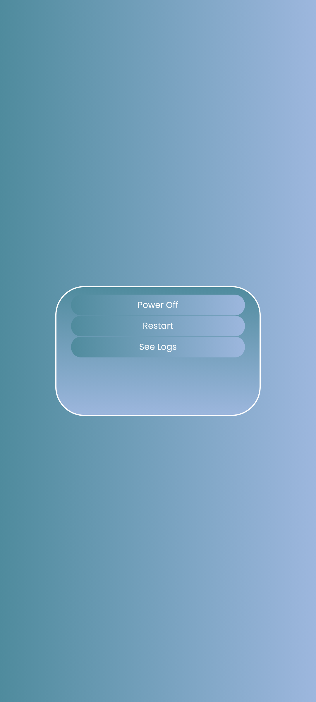
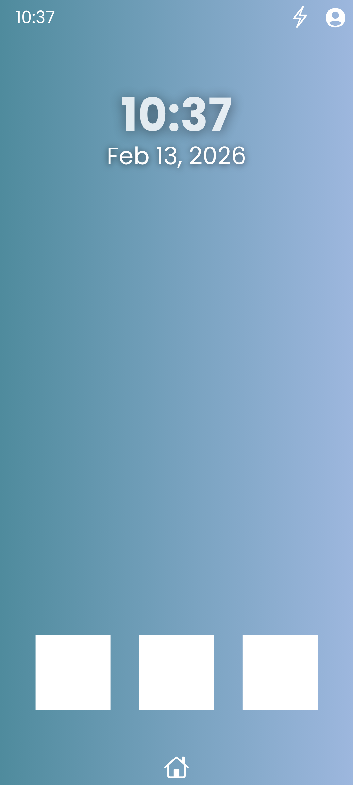

# Lumen-Stable-1.0
These are the Official 1.0 Lumen build planned after the Developer Previews Phase, which is making me think Ahead of the Time for the current month (February). Who could say when Official Lumen Stable 1.0 build will arrive? Even i don't know. So this is planning yet. Who know it can turn into reality? it can if i don't give up.

## Design (Approximate)

